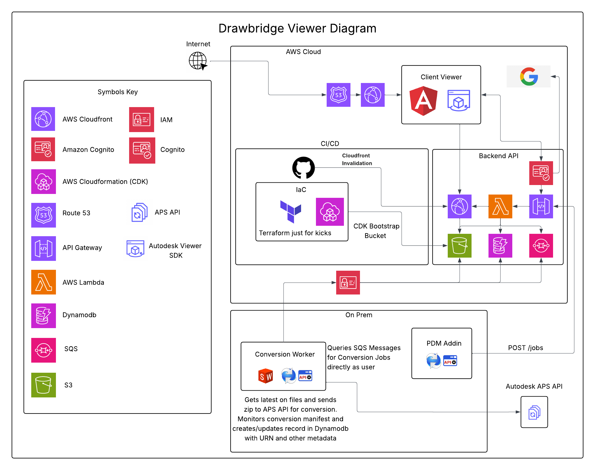

# Drawbridge

[Short description of what this project does and why it exists — revise before pushing]

## Overview

[Describe the problem: engineers need a way to view SolidWorks CAD models from a browser without installing SolidWorks. Describe the solution at a high level.]

## Architecture

[Brief narrative of the data flow: PDM vault → API → SQS → ConversionWorker → APS → Angular SPA]

## Components

| Component | Technology | Purpose |
|---|---|---|
| `src/Drawbridge.PdmAddIn` | .NET 4.8, COM | SOLIDWORKS PDM context-menu add-in |
| `src/Drawbridge.ConversionWorker` | .NET 10, Windows Service | Polls SQS; drives SolidWorks COM and APS translation |
| `src/Drawbridge.Api` | ASP.NET Core, AWS Lambda | REST API (jobs, products, viewer token, annotations, markups) |
| `src/Drawbridge.Shared` | .NET Standard 2.0 | Shared DTOs |
| `site/` | Angular 19 | SPA — product library and 3D model viewer |
| `infra/cdk/` | AWS CDK (TypeScript) | Infrastructure as code |
| `infra/terraform/` | Terraform | Infrastructure as code (mirror of CDK) |

## Infrastructure

Deployed to AWS. Key resources:

- **API Gateway + Lambda** — HTTP API backed by ASP.NET Core minimal API
- **SQS** — job queue (JobsQueue + JobsDLQ)
- **DynamoDB** — five tables: Products, Versions, Jobs, Annotations, Markups
- **S3** — drawings, markup assets, SPA static files
- **CloudFront** — CDN for SPA and drawing assets
- **Autodesk Platform Services (APS)** — SolidWorks → SVF2 translation and hosted 3D viewing

## Getting Started

[Prerequisites, setup steps, and local dev instructions — fill in as components are built]

## License

[Add license]
